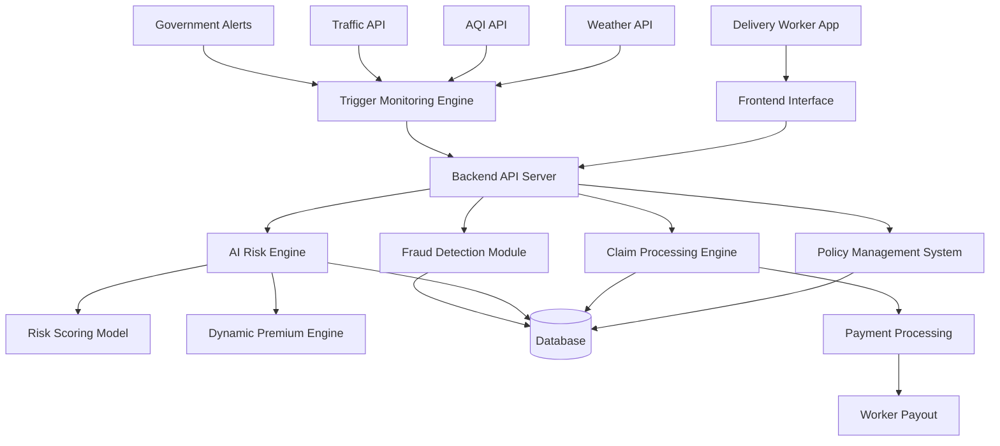
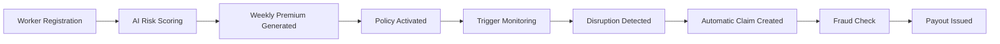
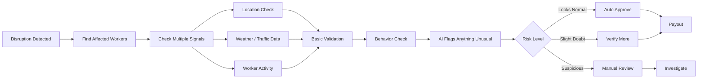

# DeliverSure
### Smart Income Protection for Delivery Partners

DeliverSure is a **parametric insurance platform** designed to protect gig delivery workers from income loss caused by external disruptions such as extreme weather, pollution, or mobility restrictions.

Delivery partners rely on continuous mobility to earn their daily wages. However, factors like heavy rainfall, extreme heat, poor air quality, traffic gridlock, or government-imposed restrictions can suddenly limit their ability to work. When this happens, their income drops immediately.

DeliverSure automatically detects such disruptions and compensates workers for the working hours they lose — **without requiring manual claims**.

---

## Key Features

- AI-powered disruption risk scoring  
- Automated parametric insurance triggers  
- Zero-touch claim processing  
- Dynamic weekly premium pricing  
- Real-time environmental monitoring  

---

# Problem Statement

India’s gig economy relies heavily on delivery partners working across food delivery, grocery delivery, and e-commerce logistics platforms.

These workers frequently face unpredictable disruptions such as:

- Heavy rainfall and flooding
- Extreme heat conditions
- Severe air pollution
- Dense fog
- Traffic gridlock
- Curfews or mobility restrictions

When these disruptions occur, delivery workers lose valuable working hours and therefore lose income.

Currently, there is **no simple insurance system designed specifically to compensate gig workers for income lost due to these external disruptions.**

DeliverSure aims to bridge this gap by introducing an **automated parametric insurance system tailored for delivery partners.**

---

# Persona: Grocery / Quick-Commerce Delivery Partner

DeliverSure focuses on grocery delivery partners operating in **hyperlocal urban delivery zones**.

| Parameter | Value |
|----------|-------|
| Daily Earnings | ₹450 – ₹600 |
| Working Hours | 8–10 hours |
| Delivery Radius | 2–4 km |
| Primary Transport | Two-wheeler |

These workers are highly vulnerable to disruptions because their income depends directly on **outdoor mobility and local operating conditions**.

---

# Parametric Disruption Triggers

DeliverSure monitors multiple external indicators in real time.  
When predefined thresholds are exceeded, the system **automatically triggers claims for affected workers.**

| Trigger | Condition | Impact |
|-------|-------|-------|
| Flash Flood / Waterlogging | Rainfall > 60 mm in 3 hours | Flooded streets block delivery routes |
| Extreme Heat | Temperature > 42°C for 2+ hours | Unsafe conditions reduce delivery activity |
| Severe Air Pollution | AQI > 400 for 2+ hours | Hazardous outdoor exposure |
| Dense Fog | Visibility < 200 m for 1+ hour | Dangerous driving conditions |
| Curfew / Restrictions | Government restriction > 2 hours | Deliveries suspended |
| Traffic Gridlock | Avg road speed < 10 km/h | Fewer deliveries completed |

---

# Trigger Monitoring Engine

DeliverSure continuously monitors disruption signals using external APIs.

**Data Sources**

- Weather APIs *(every 10 minutes)*
- Air Quality APIs *(every 30 minutes)*
- Traffic APIs *(every 15 minutes)*
- Government mobility alerts *(real-time)*

When a threshold is exceeded:

1. Affected delivery zones are identified  
2. Workers operating in those zones are detected  
3. Claims are automatically triggered  

This enables **zero-touch insurance claims** for delivery workers.

---

# AI Architecture

Artificial Intelligence powers **risk modeling, pricing, and fraud detection**.

### Risk Scoring

Each delivery zone receives a **risk score (0–1)** based on:

- Rainfall patterns
- Pollution levels
- Traffic congestion
- Flood-prone areas

### Dynamic Premium Calculation

```
Weekly Premium = Base Premium × Risk Multiplier
```

Workers operating in **low-risk zones pay lower premiums**, while high-risk zones have slightly higher premiums.

### Fraud Detection

AI-based anomaly detection helps identify suspicious claims by analyzing:

- GPS location consistency
- Claim frequency patterns
- Worker activity logs
- Duplicate claim attempts

---

# System Architecture



---

# Weekly Pricing Model

The pricing model aligns with the **weekly earning cycle of gig workers**.

| Metric | Value |
|------|------|
| Average Hourly Income | ₹70 |
| Example Disruption | 3 hours lost |
| Income Loss | ₹210 |

Assuming disruptions affect **25% of workers weekly**:

```
Expected Weekly Loss ≈ ₹52
```

### Premium Formula

```
Weekly Premium = Expected Loss + Safety Margin
```

Example Premium:

```
₹60 / week
```

---

# End-to-End Workflow



---

# Tech Stack

### Frontend
- React
- Tailwind CSS

### Backend
- FastAPI / Node.js

### AI / Machine Learning
- Python
- Scikit-learn
- Pandas

### Database
- PostgreSQL / MongoDB

### External APIs
- Weather APIs
- Air Quality APIs
- Traffic APIs

---

# Future Enhancements

- Predictive disruption alerts
- Hyperlocal risk heatmaps
- Advanced fraud detection models
- Instant payout integrations

---
## Advanced Adversarial Defense & Anti-Spoofing Strategy

To make sure our system isn’t easily exploited, we don’t rely on a single check like GPS. Instead, we combine multiple signals and simple logic with AI support to verify whether a claim is genuine or not.

---

### Adaptive Multi-Signal Validation

Instead of fixed rules, our validation adapts based on the situation.

- Some signals matter more depending on the disruption  
  (for example, weather data is more important during heavy rain, while traffic data matters more during jams)

- We don’t just check data at one moment  
  we look at how things change over the entire disruption period  

- Each signal adds to a confidence score  
  so we don’t depend on just one source and reduce false positives  

---

### Handling GPS Spoofing

We know GPS can be manipulated, so we don’t trust it blindly.

- We look for unrealistic movement (like sudden jumps in location)  
- We compare GPS with device movement data like accelerometer  
- If multiple users show identical or suspicious locations, we flag it  
- We also check if the movement pattern actually makes sense  

---

### Behavioral Intelligence

We track how a worker normally behaves and compare it with current activity.

- Typical working hours  
- Delivery frequency  
- Usual operating area  

Things that look suspicious:

- Sudden increase in claims  
- Claims at unusual times  
- Repeating the same pattern during disruptions  

We don’t block immediately — we just increase scrutiny.

---

### Detecting Fraud Rings

Fraud is often not individual — it happens in groups.

We look for patterns like:

- Multiple users claiming from the same location  
- Claims happening at the exact same time  
- Shared device or network patterns  

If we detect this, we treat it as a high-risk case instead of isolated claims.

---

### Cross-Checking with External Data

We don’t depend only on internal data.

We can also validate using:

- Network-based location (cell towers)  
- Whether the worker was actually active in that area  
- General confirmation from local conditions (news, alerts, etc.)

This makes the system harder to game.

---

### AI-Based Detection

We use AI mainly to support decisions, not blindly automate them.

- It helps detect unusual claim patterns  
- Groups similar suspicious behaviors  
- Flags outliers that don’t match normal activity  

These flagged cases can then be reviewed further.

---

### Risk-Based Claim Handling

Instead of treating all claims the same, we categorize them:

| Level | What it means | Action |
|------|-------------|--------|
| Low Risk | Looks normal | Auto payout |
| Medium Risk | Slight mismatch | Extra checks |
| High Risk | Strong suspicion | Manual review |
| Fraud Likely | Clear patterns | Reject / flag |

---

### Keeping It Fair for Genuine Workers

We don’t want strict checks to hurt honest users.

So we make sure:

- No claim is rejected based on just one signal  
- Workers can understand why a claim was flagged  
- Trust builds over time with consistent activity  
- Genuine users are not penalized for occasional anomalies  

---

## Claim Validation & Fraud Detection Flow



### Conclusion

The goal is simple:

Build a system that is hard to exploit, but still easy and fair for genuine workers.
So instead of over-complicating things, we focus on combining multiple signals, spotting patterns, and using AI only where it actually adds value.
